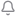
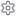
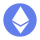

# Modulo Component Snippet Library

Copy-paste building blocks for rapid screen prototyping. Every snippet uses `modulo-shared.css` tokens and classes — no hardcoded values.

All snippets assume the standard screen shell (see Shell below). Drop components into `<div class="scroll-content">` and go.

---

## Shell: Full Screen (with bottom nav)

Use for main screens (home, explore, activity).

```html
<!DOCTYPE html>
<html lang="en">
<head>
  <meta charset="UTF-8">
  <meta name="viewport" content="width=390, initial-scale=1.0">
  <title>Modulo — Screen Name</title>
  <link rel="preconnect" href="https://fonts.googleapis.com">
  <link rel="preconnect" href="https://fonts.gstatic.com" crossorigin>
  <link href="https://fonts.googleapis.com/css2?family=Inter:wght@400;500;600;700&display=swap" rel="stylesheet">
  <link rel="stylesheet" href="modulo-shared.css">
  <style>
    /* Screen-specific styles only */
  </style>
</head>
<body>
  <div class="phone">
    <!-- Status Bar -->
    <div class="status-bar" role="img" aria-label="Phone status bar">
      <span class="status-time">9:41</span>
      <div class="status-right">
        <div class="signal-bars"><span class="signal-bar"></span><span class="signal-bar"></span><span class="signal-bar"></span><span class="signal-bar"></span></div>
        
        <div class="battery"><div class="battery-fill"></div></div>
      </div>
    </div>

    <!-- Scrollable Content -->
    <div class="scroll-content">
      <!-- COMPONENTS GO HERE -->
    </div>

    <!-- Bottom Navigation -->
    <nav class="bottom-nav" aria-label="Main navigation">
      <a href="home-screen.html" class="nav-btn" aria-label="Home" aria-current="page"></a>
      <a href="explore-screen.html" class="nav-btn" aria-label="Explore"></a>
      <a href="swap-screen.html" class="nav-btn nav-btn-swap" aria-label="Swap"></a>
      <a class="nav-btn" aria-label="Activity"></a>
      <a class="nav-btn" aria-label="Profile"></a>
    </nav>
  </div>
</body>
</html>
```

---

## Shell: Sheet (modal overlay)

Use for action screens (send, receive, swap, swap-select).

```html
<!-- Replace the scroll-content and bottom-nav sections with: -->
<div class="drag-handle"><div class="drag-handle-pill"></div></div>

<div class="scroll-content">
  <!-- Sheet header -->
  <div class="sheet-header">
    <span class="sheet-title">Sheet Title</span>
    <button class="close-btn" aria-label="Close"></button>
  </div>

  <!-- COMPONENTS GO HERE -->
</div>
```

---

## Component: Logo Header

Used on home screen. Logo left, action icons right.

```html
<div class="header" style="height:44px; display:flex; align-items:center; justify-content:space-between; padding:0 29px 0 20px;">
  <a href="home-screen.html" class="header-logo"></a>
  <div style="display:flex; align-items:center; gap:30px;">
    <button aria-label="Notifications" style="display:flex; width:16px; height:16px;"></button>
    <button aria-label="Settings" style="display:flex; width:16px; height:16px;"></button>
  </div>
</div>
```

---

## Component: Token Row

Used on home (token list), swap-select (token picker). Shows icon + name/amount + value/change.

```html
<style>
  .token-row {
    display: flex;
    align-items: center;
    gap: 16px;
    height: 76.5px;
    border-bottom: 1px solid var(--bk-border-subtle);
    cursor: pointer;
  }
  .token-row:last-child { border-bottom: none; }
  .token-row:hover { background: rgba(26, 26, 41, 0.5); }
  .token-row img.token-icon { width: 42px; height: 42px; flex-shrink: 0; }
  .token-info { flex: 1; }
  .token-name { font-size: 15px; font-weight: 500; color: var(--bk-text-primary); line-height: 1.5; }
  .token-amount { font-size: 12px; font-weight: 400; color: var(--bk-text-muted); opacity: 0.7; line-height: 1.5; }
  .token-value { text-align: right; }
  .token-price { font-size: 15px; font-weight: 500; color: var(--bk-text-primary); line-height: 1.5; }
  .token-change { font-size: 12px; font-weight: 400; line-height: 1.5; }
</style>

<div class="token-row" role="button" tabindex="0">
  
  <div class="token-info">
    <div class="token-name">Ethereum</div>
    <div class="token-amount">1.4 ETH</div>
  </div>
  <div class="token-value">
    <div class="token-price">$4,893.80</div>
    <div class="token-change text-positive">+2.41%</div>
  </div>
</div>
```

---

## Component: Contact Row

Used on send screen. Avatar with Modulo badge + name/address.

```html
<style>
  .contact-row {
    display: flex;
    align-items: center;
    gap: 16px;
    height: 77px;
    border-bottom: 1px solid var(--bk-border-row);
    cursor: pointer;
  }
  .contact-row:hover { background: rgba(26, 26, 41, 0.5); }
  .contact-name { font-size: 15px; font-weight: 500; color: var(--bk-text-primary); line-height: 1.5; }
  .contact-address { font-size: 12px; font-weight: 400; color: var(--bk-text-muted); line-height: 1.5; }
</style>

<div class="contact-row" role="button" tabindex="0">
  <div class="avatar-wrap">
    
    
  </div>
  <div>
    <div class="contact-name">Alex Rivera</div>
    <div class="contact-address">0x7F4e...3A91</div>
  </div>
</div>
```

---

## Component: Card (gradient background)

Base card pattern used by portfolio, favourites, swap cards, address card. Adjust height/padding per use.

```html
<style>
  .card {
    margin: 0 16px;
    background: linear-gradient(135deg, var(--bk-bg-card) 0%, var(--bk-bg-card-alt) 100%);
    border: 1px solid var(--bk-border-card);
    border-radius: 16px;
    padding: 17px 16px;
    position: relative;
    overflow: hidden;
  }
</style>

<div class="card">
  <!-- Card content -->
</div>
```

---

## Component: Earn / Promo Card

Purple-tinted promotional card. Used on home screen.

```html
<style>
  .earn-card {
    margin: 0 16px;
    background: var(--bk-earn-card-bg);
    border: 1px solid var(--bk-earn-card-border);
    border-radius: 16px;
    padding: 17px 17px;
    display: flex;
    align-items: center;
    justify-content: space-between;
  }
  .earn-label { font-size: 12px; font-weight: 500; color: var(--bk-brand-primary); line-height: 1.5; }
  .earn-value { font-size: 22px; font-weight: 700; color: var(--bk-text-primary); line-height: 1.5; }
  .earn-unit { font-size: 13px; font-weight: 400; color: var(--bk-text-secondary); opacity: 0.7; line-height: 1.5; }
  .earn-btn {
    background: var(--bk-brand-primary);
    border-radius: 9999px;
    padding: 8px 20px;
    font-size: 13px;
    font-weight: 600;
    color: #fff;
  }
</style>

<div class="earn-card">
  <div>
    <div class="earn-label">Staking Rewards</div>
    <div class="earn-value">4.2<span class="earn-unit">% APY</span></div>
  </div>
  <button class="earn-btn">Earn</button>
</div>
```

---

## Component: Quick Actions Row

Circular action buttons with labels. Used on home screen.

```html
<style>
  .actions-row {
    display: flex;
    justify-content: center;
    gap: 24px;
    padding: 16px 0;
  }
  .action-btn {
    display: flex;
    flex-direction: column;
    align-items: center;
    gap: 8px;
  }
  .action-circle {
    width: 48px;
    height: 48px;
    border-radius: 50%;
    background: var(--bk-bg-card);
    border: 1px solid var(--bk-border-subtle);
    display: flex;
    align-items: center;
    justify-content: center;
  }
  .action-circle img { width: 20px; height: 20px; }
  .action-label { font-size: 11px; font-weight: 500; color: var(--bk-text-secondary); line-height: 1.5; }
</style>

<div class="actions-row">
  <a href="swap-screen.html" class="action-btn">
    <div class="action-circle"></div>
    <span class="action-label">Swap</span>
  </a>
  <a class="action-btn">
    <div class="action-circle"></div>
    <span class="action-label">Buy</span>
  </a>
  <a href="send-screen.html" class="action-btn">
    <div class="action-circle"></div>
    <span class="action-label">Send</span>
  </a>
  <a href="receive-screen.html" class="action-btn">
    <div class="action-circle"></div>
    <span class="action-label">Receive</span>
  </a>
</div>
```

---

## Component: Favourite Card (compact)

Small vertical card showing token + sparkline. Used on explore screen.

```html
<style>
  .fav-card {
    flex: 1;
    height: 151px;
    background: var(--bk-bg-card);
    border: 1px solid var(--bk-border-subtle);
    border-radius: 16px;
    padding: 17px 17px 1px;
    display: flex;
    flex-direction: column;
    justify-content: space-between;
    overflow: hidden;
  }
  .fav-card-top { display: flex; align-items: center; gap: 8px; }
  .fav-card-top img { width: 30px; height: 30px; }
  .fav-card-top span { font-size: 15px; font-weight: 600; color: var(--bk-text-primary); line-height: 1.5; }
  .fav-price { font-size: 14px; font-weight: 500; color: var(--bk-text-primary); line-height: 1.5; margin-top: 4px; }
  .fav-change { font-size: 12px; font-weight: 400; line-height: 1.5; }
  .fav-chart { margin-top: auto; height: 48px; width: 100%; }
  .fav-chart img { width: 100%; height: 100%; object-fit: contain; }
</style>

<div style="display:flex; gap:8px; padding:0 16px;">
  <div class="fav-card">
    <div class="fav-card-top">
      
      <span>BTC</span>
    </div>
    <div class="fav-price">$97,842<span class="fav-change text-positive"> +1.24%</span></div>
    <div class="fav-chart"></div>
  </div>
  <!-- Repeat for more cards -->
</div>
```

---

## Component: Swap Card (input field)

Token amount input with token selector pill. Used on swap screen.

```html
<style>
  .swap-card {
    background: linear-gradient(180deg, var(--bk-bg-card), var(--bk-bg-card-alt));
    border: 1px solid var(--bk-border-subtle);
    border-radius: 16px;
    padding: 16px;
    display: flex;
    flex-direction: column;
    justify-content: space-between;
    height: 138px;
  }
  .swap-card-label { font-size: 12px; font-weight: 400; color: var(--bk-text-muted); line-height: 1.5; }
  .swap-amount { font-size: 32px; font-weight: 300; color: var(--bk-text-primary); line-height: 1.2; }
  .swap-card-bottom { display: flex; align-items: center; justify-content: space-between; }
  .swap-usd { font-size: 13px; font-weight: 400; color: var(--bk-text-muted); }
  .swap-balance { font-size: 12px; font-weight: 400; color: var(--bk-text-muted); }
</style>

<div class="swap-card" style="margin:0 16px;">
  <div>
    <div class="swap-card-label">You pay</div>
    <div style="display:flex; align-items:center; justify-content:space-between; margin-top:8px;">
      <span class="swap-amount">0.5</span>
      <div class="token-pill">
        
        <span style="font-size:14px; font-weight:600; color:var(--bk-text-primary);">ETH</span>
        
      </div>
    </div>
  </div>
  <div class="swap-card-bottom">
    <span class="swap-usd">≈ $1,633.80</span>
    <span class="swap-balance">Balance: 1.4 ETH</span>
  </div>
</div>
```

---

## Component: Section Label

Small uppercase label above a section.

```html
<div style="padding:0 16px; margin-bottom:8px;">
  <span style="font-size:12px; font-weight:500; color:var(--bk-text-muted); text-transform:uppercase; letter-spacing:0.07em; line-height:1.5;">
    Section Title
  </span>
</div>
```

---

## Component: Tabs (Tokens / NFTs style)

Horizontal tab bar with active underline.

```html
<style>
  .tabs {
    display: flex;
    border-bottom: 1px solid var(--bk-border-subtle);
    margin: 0 16px;
  }
  .tab {
    flex: 1;
    text-align: center;
    padding: 12px 0;
    font-size: 15px;
    font-weight: 400;
    color: var(--bk-text-muted);
    line-height: 1.5;
    position: relative;
  }
  .tab.active {
    font-weight: 600;
    color: var(--bk-text-primary);
  }
  .tab.active::after {
    content: '';
    position: absolute;
    bottom: -1px;
    left: 0;
    right: 0;
    height: 2px;
    background: var(--bk-brand-primary);
    border-radius: 1px;
  }
</style>

<div class="tabs" role="tablist">
  <button class="tab active" role="tab" aria-selected="true">Tokens</button>
  <button class="tab" role="tab" aria-selected="false">NFTs</button>
</div>
```

---

## Component: Address Card (with copy/share)

Used on receive screen. Shows wallet address with action buttons.

```html
<style>
  .address-card {
    margin: 16px 20px 0;
    background: linear-gradient(135deg, var(--bk-bg-card) 0%, var(--bk-bg-card-alt) 100%);
    border: 1px solid var(--bk-border-card);
    border-radius: 16px;
    padding: 17px;
    min-height: 76.5px;
    display: flex;
    align-items: center;
    justify-content: space-between;
  }
  .address-left { display: flex; align-items: center; gap: 12px; }
  .address-name { font-size: 15px; font-weight: 500; color: var(--bk-text-primary); line-height: 1.5; }
  .address-hash { font-size: 12px; font-weight: 400; color: var(--bk-text-muted); line-height: 1.5; }
  .address-actions { display: flex; gap: 8px; }
  .address-actions button { display:flex; align-items:center; justify-content:center; width:32px; height:32px; }
</style>

<div class="address-card">
  <div class="address-left">
    <div class="avatar-wrap">
      
      
    </div>
    <div>
      <div class="address-name">My Wallet</div>
      <div class="address-hash">0x7F4e...3A91</div>
    </div>
  </div>
  <div class="address-actions">
    <button aria-label="Copy address"></button>
    <button aria-label="Share"></button>
  </div>
</div>
```

---

## Component: Chain Filter Pills

Horizontal scrolling pill row for filtering. Used on explore, receive.

```html
<div style="display:flex; gap:8px; padding:0 16px; overflow-x:auto; scrollbar-width:none; margin-bottom:16px;">
  <button class="chain-pill active">All</button>
  <button class="chain-pill">Ethereum</button>
  <button class="chain-pill">Solana</button>
  <button class="chain-pill">Polygon</button>
  <button class="chain-pill">Arbitrum</button>
</div>
```

---

## Component: Network Pills (with icons)

Used on receive screen for network selection.

```html
<div style="display:flex; flex-wrap:wrap; gap:8px; padding:0 20px; justify-content:center;">
  <button class="pill active"><span>Ethereum</span></button>
  <button class="pill"><span>Solana</span></button>
  <button class="pill"><span>Polygon</span></button>
</div>
```

---

## Component: Percentage Pills

Used on swap screen for quick amount selection.

```html
<div style="display:flex; gap:8px; padding:0 16px;">
  <button class="pct-pill">25%</button>
  <button class="pct-pill active">50%</button>
  <button class="pct-pill">75%</button>
  <button class="pct-pill">Max</button>
</div>
```

---

## Component: QR Code Block

Centred QR code with token icon overlay. Used on receive screen.

```html
<style>
  .qr-block {
    display: flex;
    flex-direction: column;
    align-items: center;
    padding: 24px 0;
  }
  .qr-wrap {
    position: relative;
    width: 200px;
    height: 200px;
    background: #fff;
    border-radius: 16px;
    display: flex;
    align-items: center;
    justify-content: center;
  }
  .qr-wrap img.qr { width: 180px; height: 180px; }
  .qr-overlay {
    position: absolute;
    width: 40px;
    height: 40px;
  }
</style>

<div class="qr-block">
  <div class="qr-wrap">
    
    
  </div>
</div>
```

---

## Available Assets (in `assets/`)

### Tokens
`token-usdc.svg` · `token-btc.svg` · `token-eth.svg` · `token-sol.svg` · `token-usdt.svg`

### Navigation
`icon-nav-home.svg` · `icon-nav-search.svg` · `icon-nav-swap.svg` · `icon-nav-activity.svg` · `icon-nav-profile.svg`

### Actions
`icon-action-swap.svg` · `icon-action-buy.svg` · `icon-action-send.svg` · `icon-action-receive.svg`

### UI
`icon-notification.svg` · `icon-settings.svg` · `icon-close.svg` · `icon-wifi.svg` · `icon-chevron-down.svg` · `icon-copy.svg` · `icon-share.svg` · `icon-scan.svg` · `icon-search.svg` · `icon-gain-arrow.svg`

### Brand
`logo-modulo.svg` · `badge-modulo.svg`

### Charts
`chart-line.svg` · `chart-btc-spark.svg` · `chart-eth-spark.svg`

---

## Quick Recipe: New Screen

1. Copy the **Shell** (full screen or sheet)
2. Pick components from this file
3. Drop them into `scroll-content`
4. Add screen-specific styles in the `<style>` block — only what's unique
5. Save as `new-screen-name.html`
6. All tokens come from `modulo-shared.css` — never hardcode colours
